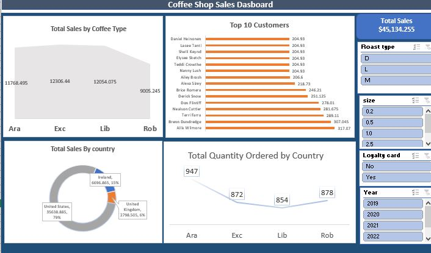
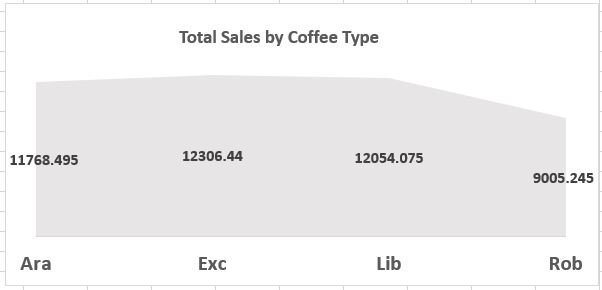
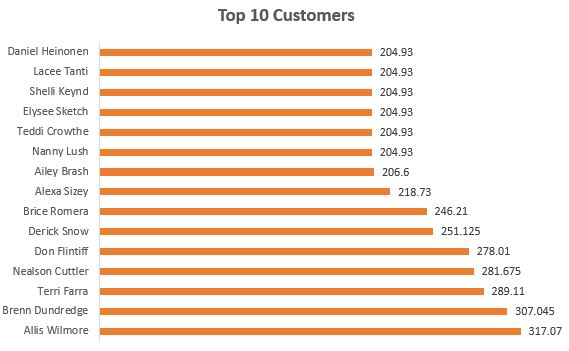
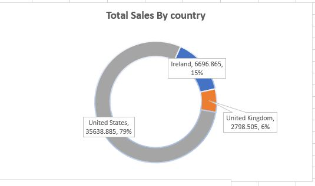
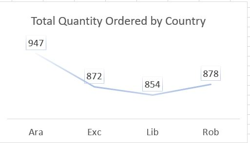

# Coffee-shop-Sales-Analysis
You’ve been hired as a data analyst in a coffee shop, your task is to; Find trends of total sales for each coffee type, generate a table or chart highlighting the top 10 customers based on their contribution to total sales, find total sales by each country and find the total quantity ordered for each coffee type. 

## Introduction
Excel project focusing on sales analysis of a coffee shop for the year 2019 to 2022.

## Problem statement
1.	Find trends of total sales for each coffee type.
2.	Generate a table or chart highlighting the top 10 customers based on their contribution to total sales.
3.	Find total sales by each country.
4.	Find the total quantity ordered for each coffee type.
5.	Additionally: Add filtering options for roast type, loyalty card, year and size.

## Skills demonstrated
•	Filtering
•	XLookup
•	Quick measures
•	Entering and formatting data
•	Sorting and filtering data
•	Data cleaning.

## Data sourcing
An imaginary coffee shop data set.

## Data transformation
1.	I verified that every field in the dataset—text, binary, integer, data, etc.—was formatted appropriately.
2.	To prepare the data for analysis, I used Power Bi to do data cleaning and duplicate elimination.
3.	I used XLookup to extract information needed from other two files containing necessary details.

## Analysis and visualization
Numerous discoveries were made by using a variety of chart forms, including pie, bar, and doughnut charts.

##  Coffee Shop Sales Dashboard

### Total sales for each coffee type.

## Top 10 customers based on their contribution to total sales

## Total sales by each country

## The total quantity ordered for each coffee type.

## Insight
#### Top 10 clients
With a $317.07 sales value, Allis Winmore is the most expensive client, closely followed by Terri Farra and Brennen Dundredge. The sales values of the top ten clients fall within a certain range, ranging from $204.93 to $317.07.

#### Sales by nation 
The United States accounts for 79% of all sales, or $35,638.885, making it the market leader. Ireland comes in second with 15% of total sales ($6,698), followed by the UK with 6% ($2,798). 

#### The total amount ordered by kind of coffee 
With 947 orders, araba is the most popular coffee variety. Lib had the lowest amount ordered, at 854. 
With 878 and 872 orders, respectively, Rob and Exc have about the same quantity.

#### Coffee type sales 
Lib coffee tops the list with $12,054.75, followed by Exc with $12,306.4. Rob and Ara come in second and third, with $11,768.4 and $9,005.245 in sales, respectively. 

## Conclusion
The coffee shop's sales primarily come from its loyal client base, particularly in the US. Boosting sales through loyalty programs and consumer involvement, as well as enhancing Ara Coffee's pricing and marketing strategies, and targeting lagging markets like the UK and Ireland.

## Recommendation
##### Customer engagement and loyalty 
•	Focus on building loyalty programs for top customers like Allis Winmore and others in the top 10 list to maintain their engagement and increase their spending. 
•	Consider targeted promotions or discounts for the customers with sales around $204.93 to encourage more frequent purchases and potentially elevate their sales volume. 

#### Country-specific strategies 
•	The United States accounts for a vast majority of sales since it is already a strong market. Consider scaling marketing efforts here with promotions or new coffee products. 
•	for Ireland and the United Kingdom, which contribute relatively lower percentages invest in targeted advertising or explore local partnerships to boost sales and improve market penetration. 

#### Coffee type optimization
•	Although lib and Exc have the highest sales values, Ara has the highest number of orders. This suggests that Ara may have potential for higher revenue if better pricing or bundling strategies are applied. 
•	Consider cross-selling strategies like offering Ara and rob with promotional discounts as they generate lower revenue despite a higher or competitive order quantity. 

#### Inventory and demand forecasting 
•	Since Ara has the highest order quantity, ensure sufficient inventory to meet customer demand and avoid stockouts. 
•	track customer preferences closely over time to adjust supply levels for coffee types like lib and Exc which have slightly lower order quantities but higher sales

